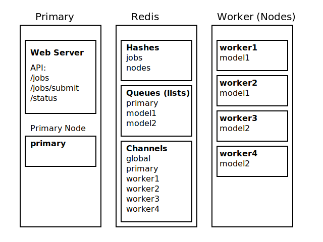

Model Runner
============

Model Runner is a light-weight job management web application.  
The purpose is to distribute model runs (i.e. jobs) across servers.

Components
----------

- Primary Server
  
    The server that hosts the model_runner REST API and manages jobs

- Worker 

    A server that runs jobs and exposes job log and ability to stop a running job

- Model
  
    Model that can be run with inputs on a Worker

REST API (Primary and Worker Servers)
--------

- /submit (Primary only)

    Post a job (input as zip, model, email)

- /get (Primary only)

    Get output of completed job (output as zip, json?)

- /view

    All (view list of jobs) or specific job (job log)

- /stop

    Stop a running job

Worker Process
--------------

Workers implement 3 basic methods:

- get 

Workers will poll Primary for job assignment via database lookup of "New" jobs, which
then become "Assigned".  They then attempt to retrieve the input data to run locally.  

- run

Once job data has been retrieved, the job model is looked up and run against the input

- finish

Post the output and notify Primary that the job is complete

Note:  Workers will log both info and error output which will be available via web-interface through the Primary server

